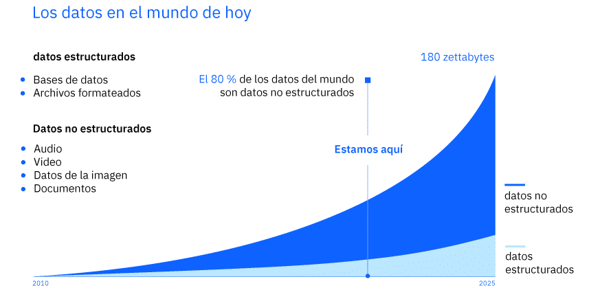
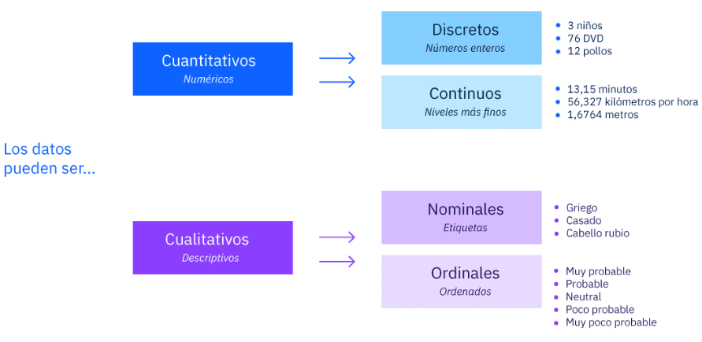
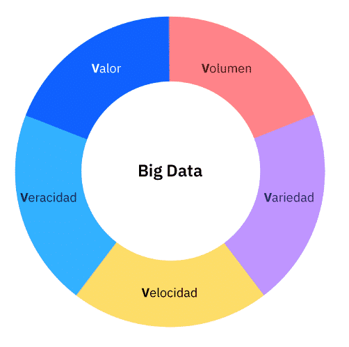
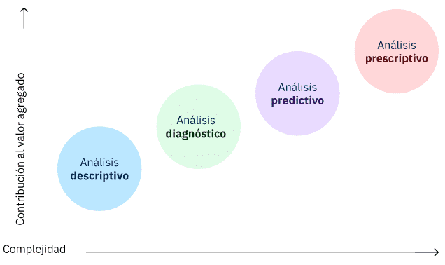
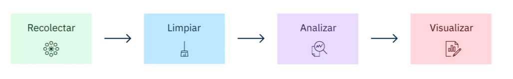
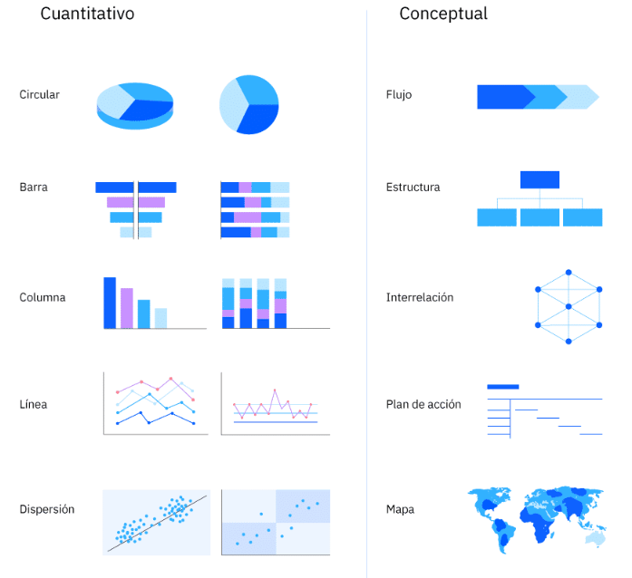
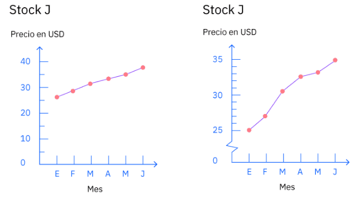

# Conceptos de los datos

## Tipos de datos

Los datos son fundamentales para los negocios y tienen un gran valor. Los datos son uno de los activos más valiosos que pueden tener las organizaciones, ya sea en los negocios, las finanzas, la atención médica, el comercio minorista, la tecnología, el marketing u otras industrias.

[Our wolrd in data](https://ourworldindata.org/)

### ¿Cuantos datos hay?

Se proyecta que para 2025, la creación global de datos crecerá a más de 180 zettabytes. ¡Un zettabyte es el número 1 seguido de 21 ceros! En 2020, la cantidad de datos creados y replicados alcanzó un nuevo máximo. El crecimiento fue mayor de lo que se esperaba debido al aumento de demanda a causa de la pandemia del COVID-19, ya que más personas trabajaron y estudiaron desde casa y utilizaron opciones de entretenimiento en el hogar con mayor frecuencia.

[Amount of data created, consumed and stored between 2010-2025](https://www.statista.com/statistics/871513/worldwide-data-created/)

### Los datos pueden ser estructurados o no estructurados

#### Datos Estructurados

Los datos estructurados son información que se puede organizar en filas y columnas. Quizás hayas visto datos estructurados en una hoja de cálculo, como Google Sheets o Microsoft Excel. Para información compleja, los analistas de datos utilizan herramientas como el lenguaje de consulta estructurado (SQL), que puede ordenar grandes cantidades de datos almacenados en muchas tablas conectadas. Si puedes organizar la información dentro de los datos en grupos, según características específicas, entonces esos grupos son datos estructurados.

Algunos ejemplos de datos estructurados incluyen nombres, fechas, direcciones, números de tarjetas de crédito, información bursátil y geolocalización. Los datos estructurados son la forma de datos más útil porque están altamente organizados y se pueden manipular.

A continuación se ofrece una muestra de datos estructurados de los registros de una ferretería. Esta tabla organiza la información de los clientes de la ferretería por características, como número de cliente y apellido. Cada fila muestra información relacionada con un cliente específico, mientras que cada columna muestra una característica del cliente que abarca un grupo de clientes.

|Numero de cliente  |Apellido   |Número de teléfono |fecha pedido último    |
|-------------------|-----------|-------------------|-----------------------|
|00001              |Ajay       |(555) 678-9012     |12 marzo 2020          |
|00002              |Thompson   |(555) 345-6789     |14 agosto 2021         |
|00003              |Herrero    |(555) 432-1098     |01 agosto 2021         |
|00004              |Kim        |(555) 665-5443     |16 noviembre 2021      |
|00005              |González   |(555) 912-9945     |29 diciembre 2019      |
|00006              |Wangzi     |(555) 212-3767     |30 junio 2022          |
|00007              |Colbert    |(555) 866-0922     |9 enero 2022           |
|00008              |Jarrah     |(555) 778-1845     |12 septiembre 2020     |
|00009              |Magunusson |(555) 395-7677     |14 abril 2022          |
|00010              |Taki       |(555) 550-5515     |30 octubre 2021        |

#### Datos no estructurados

Los datos no estructurados se refieren a "todo lo demás". No hay un formato predefinido. Los datos no estructurados carecen de cualquier organización o estructura incorporada. Es una conglomeración de diversos tipos de datos que se almacenan en sus formatos originales.  

Los ejemplos de datos no estructurados incluyen imágenes, textos, publicaciones en redes sociales, como tweets, comentarios de clientes, registros médicos e incluso letras de canciones.

#### A tener en cuenta

Puede ser más difícil trabajar con datos no estructurados que con datos estructurados. Sin embargo, los datos no estructurados revelan lo que la gente no sabe: lo desconocido. A menudo, la información se obtiene analizando datos no estructurados.

### Bases de datos

Una base de datos es una colección organizada de datos estructurados en un sistema informático. Una base de datos mantiene los datos altamente organizados, de modo que sean fácilmente accesibles mediante consultas y software de cálculo.

La mayoría de las bases de datos están organizadas como bases de datos relacionales. Las bases de datos relacionales son colecciones de múltiples conjuntos de datos o tablas que se vinculan entre sí.

### Cualitativos o Cuantitativos

**Datos cuantitativos**:

+ También se llaman datos **numéricos**
+ Representan cosas que se pueden medir y a las que se les pueden asignar valores.
+ Se pueden contar y medir, como la altura, el peso, la longitud, la presión arterial, la temperatura exterior, etc.
  
**Datos Cualitativos**:

+ También se llaman datos **categóricos**
+ Representan las características, atributos, propiedades y cualidades de las cosas.
+ Describen datos utilizando lenguaje (en lugar de números), como olor, ubicación, color, textura, estado civil, etc.

#### Un par de distinciones más sobre os datos

+ Los datos **cuantitativos** pueden ser discretos o **continuos**.
+ Los datos **cualitativos** pueden ser nominales u **ordinales**.

## BIG DATA

En un mundo digital, cada persona que utiliza dispositivos como estos deja un rastro de datos. El término para este tipo de datos es big data.

El término “big data” existe desde hace años, pero no existe una definición oficial y universal de big data.

### 5 V's

Los elementos de big data se pueden explicar utilizando cinco características generales llamadas **5 V**. Las 5 V son **Volumen**, **Variedad**, **Velocidad**, **Veracidad** y **Valor**. Las 5 V ayudan a los científicos de datos a comprender con qué están trabajando y se representan en este diagrama.

## Tipos de análisis de datos

La industria de la tecnología de la información (TI) generalmente reconoce cuatro tipos de análisis de datos:

+ Análisis descriptivo
+ Análisis de diagnóstico
+ Análisis predictivo
+ Análisis prescriptivo

Como se muestra en el diagrama anterior, **el grado de dificultad y los recursos necesarios** aumentan para cada tipo de análisis de datos. Al mismo tiempo, el **nivel de información y el valor añadido** también aumentan.

### Análisis Descriptivo

El análisis descriptivo responde a la pregunta: "¿Qué está pasando?". Proporciona una instantánea de las tendencias y patrones comerciales y utiliza datos históricos y actuales.

El análisis descriptivo manipula datos sin procesar de múltiples fuentes para brindar al analista de datos información valiosa sobre el pasado y una visión de las métricas clave dentro de una empresa.

Estos hallazgos podrían indicar que algo está bien o mal, pero no explican por qué. Sin embargo, los hallazgos pueden ayudar a determinar cuáles son los mayores problemas y dónde empezar a investigar.

### Análisis diagnóstico

El análisis de diagnóstico toma la información obtenida del análisis descriptivo y la profundiza para encontrar las causas de problemas específicos.

Las empresas utilizan análisis de diagnóstico porque crea más conexiones entre datos e identifica patrones de comportamiento.

### Análisis predictivo

El análisis predictivo tiene como objetivo realizar previsiones. Este tipo de análisis utiliza datos históricos para realizar predicciones sobre el futuro. Ya sea la probabilidad de un evento futuro, pronosticar una cantidad cuantificable o estimar un punto en el tiempo en el que algo podría suceder, todo esto se hace a través de modelos predictivos.

En un mundo de gran incertidumbre, poder predecir permite a las empresas tomar mejores decisiones.

Este tipo de análisis es más avanzado y a menudo puede depender del aprendizaje automático y del aprendizaje profundo.

### Análisis prescriptivo

El análisis prescriptivo combina la información de todos los análisis de datos anteriores para determinar el curso de acción a seguir para abordar un problema o tomar una decisión.

El propósito del análisis prescriptivo es prescribir qué acciones tomar para eliminar un problema futuro o aprovechar al máximo una tendencia prometedora.

El análisis prescriptivo se utiliza generalmente para un conjunto de acciones, en lugar de para una acción individual. Esto requiere un gran compromiso por parte de las empresas para poner en marcha la estrategia, el esfuerzo y los recursos. A medida que la tecnología continúa mejorando y más profesionales se capacitan en datos, más empresas ingresarán a este ámbito impulsado por los datos.

El análisis prescriptivo utiliza herramientas y tecnologías avanzadas, como aprendizaje automático, reglas comerciales y algoritmos. Esto hace que el análisis prescriptivo sea sofisticado de implementar y gestionar.

||Descriptive Analysis|Diagnostic Analysis|Predictive Analysis|Prescriptive analysis|
|---|---|---|---|---|
|Purpose|Learn what happened.|Learn why something happened.|Learn what is likely to happen.|Learn what to do.|
|Output|Static reports with KPIs.|Reports with drill-down, slicing, and dicing capabilities.|Forecasts.|Actionable recommendations.|
|Examples|Sales volume for the last month.|Why sales volume was below the target.|The projected sales volume for the next month.|A recommendation on how to increase sales volume, e.g., by adjusting loyalty policies.|
|Implementation costs|$50,000–$150,000|$30,000–$250,000 (if added on  of descriptive analytics)|$30,000– $150,000 (if added on top of descriptive analytics)|$150,000–$300,000(if added on top of descriptive, diagnostics and predictive analytics)|

[Fuente: tabla](https://www.scnsoft.com/blog/4-types-of-data-analytics)

## Pasos para analizar Datos

El análisis de datos es el proceso de recopilar, limpiar y transformar datos para obtener información que ayude a tomar decisiones mejores e informadas.

Si bien no existe un proceso de análisis de datos prescrito, estos son los pasos típicos a seguir.

### Vision y experiencia de un analista de datos

#### Recopilar

Este es el punto de partida del proceso. Este paso tiene que ver con recopilar los datos correctos y suficientes para las preguntas o problemas del proyecto que queremos investigar.

Primero determino los datos que puedo recopilar de las fuentes y bases de datos existentes que ya tenemos y que se relacionan con el problema que mi empresa quiere resolver. ¡Siempre recopilo estos datos primero!

Luego, averiguo si mi proyecto necesita nuevas fuentes de datos porque esto podría significar más tiempo para el proyecto y potencialmente una mayor inversión de mi grupo empresarial.

Mi equipo y yo usamos las herramientas de recopilación de datos de nuestra empresa y seguimos las pautas de recopilación de datos. También tenemos cuidado de almacenar de forma segura los datos en nuestros servidores en la nube.  

Un punto crucial que me gustaría destacar es que debes recopilar suficientes datos para no distorsionar los resultados de tu análisis

#### Limpiar

La limpieza de datos es el proceso de detectar y corregir registros faltantes o inexactos de un conjunto de datos.

Una gran parte de este paso es asegurarse de que los datos estén en un formato utilizable. Esto implica buscar lo que llamamos 'valores atípicos', tratar con valores nulos y buscar datos que puedan haberse ingresado incorrectamente. En pocas palabras, los datos sin procesar tendrán valores faltantes e inexactos que debo abordar.

Quizás hayas escuchado el término, 'organización de datos'. 'Ordeno' los datos para que estén en un formato utilizable para mi proyecto en nuestro sistema de base de datos. Por ejemplo, buscaré registros duplicados y los eliminaré.

No hay dos conjuntos de datos iguales, por lo que la forma en que limpio los datos puede variar. Limpio los datos en función del contexto. En un caso, ver una entrada en blanco podría equivaler a una entrada cero, por lo que son datos buenos y valiosos. Pero, en otro caso, ver una entrada en blanco podría significar que hay datos incompletos que necesito excluir. ¡Este es el arte de la ciencia de datos!

¡Guarda siempre tus datos ya que este es un proceso iterativo!

Ah, y un dato interesante. ¡Aquí es donde paso la mayor parte de mi tiempo, limpiando los datos! Calculo que los analistas de datos suelen dedicar entre el 70 y el 80 % de su tiempo a limpiar datos. Es mucho trabajo duro. Pero es imprescindible para poder pasar al análisis.

#### Analizar

Una vez que tengo los datos relevantes y están limpios, es hora de analizarlos. Este es el paso en el que los analistas de datos dedican entre el 20 y el 30 % de su tiempo. ¡Es la parte divertida y gratificante!

Puedo sentir curiosidad e investigar. Y mis habilidades para resolver problemas entran en juego. Aquí utilizo diferentes métodos estadísticos y analíticos y herramientas de software. Es importante que alinee mis métodos de análisis para que coincidan con la intención del problema.

Básicamente, identifico problemas y uso análisis para determinar las causas fundamentales de los problemas. Analizo tendencias, correlaciones, variaciones y valores atípicos para ayudarme a concentrarme en responder las preguntas (y cualquier pregunta u objeción que otros puedan tener).

A medida que manipulo datos, puedo descubrir que tengo exactamente los datos que necesito, pero lo más probable es que tenga que revisar mis preguntas originales o recopilar más datos. Esto puede generar análisis adicionales y es una de las razones por las que debes guardar siempre tus datos.

#### Visualizar

Después de analizar los datos, interpreto los resultados. Pienso: '¿Qué aprendí de los resultados de mi análisis? ¿Los datos responden a mis preguntas originales? ¿Cómo?'.

Para interpretar los resultados, creo visualizaciones de datos. Me ayudan a comparar conjuntos de datos y observar relaciones. Tenemos un par de herramientas que me encanta usar para esto.

Y, una vez que puedo sacar mis conclusiones, las visualizaciones me ayudan a mostrar gráficamente mis resultados de una manera que mi equipo y mi liderazgo pueden entenderlos fácil y concisamente. A menudo encuentro que elijo gráficos de barras, gráficos de líneas, gráficos de dispersión y mapas. Me gusta descubrir la mejor manera de representar los datos.

Normalmente tenemos una presentación y una reunión en equipo para revisar los resultados y las visualizaciones de datos. Nuestro objetivo es asegurarnos de que los conocimientos que he obtenido se puedan aplicar al problema empresarial y podamos tomar medidas, hacer cambios o reorientar los esfuerzos según sea necesario.

### Extraer, transformar y cargar (ETL)

Es posible que escuches el término **"ETL"** utilizado en entornos de trabajo basados en computadoras, en relación con datos, almacenamiento de datos y análisis. ETL es un acrónimo de **extraer**, **transformar** y **cargar** (Extract, Transform, Load).

ETL proporciona la base para el análisis de datos y los flujos de trabajo de aprendizaje automático. Las organizaciones a menudo utilizan ETL para:

+ extraer datos de sistemas heredados
+ limpiar los datos para mejorar la calidad de los datos y establecer la coherencia
+ cargar datos en una base de datos de destino

## Visualización de datos

Una visualización de datos es una representación gráfica de información abstracta o compleja. Los analistas de datos utilizan visualizaciones como gráficos y mapas por dos razones:

+ Para explorar e interpretar datos durante el análisis para identificar patrones o tendencias
+ Para comunicar resultados y ayudar a las personas a comprender los conocimientos para tomar decisiones

El objetivo es tener un elemento visual que sea eficaz, atractivo e impactante. Lo sorprendente es que, en última instancia, las visualizaciones de datos convierten los números en narrativas.

La narración de datos implica una combinación de **datos**, **visualizaciones** y **narrativa**.

+ Cuando la narrativa se combina con los datos, explica al público qué está sucediendo con los datos y por qué es importante obtener información.
+ Cuando se aplican visualizaciones a los datos, estas brindan al público información que tal vez no se podría obtener sin gráficos o cuadros. Los patrones y tendencias surgen de todas las filas y columnas de una base de datos, con la ayuda de visualizaciones de datos.
+ Cuando la narrativa y las visualizaciones se unen, pueden crear una historia de datos que puede influir, impulsar el cambio e involucrar al público.

### Tipos de Visualizaciones

Cada tipo de gráfico representa un tipo diferente de comparación entre los datos que se están analizando.

+ **Proporción relativa**: La proporción relativa es el número o la cantidad de un subconjunto presente en la población de todos los puntos de datos. Por ejemplo, si hay 25 estudiantes en una clase, de los cuales 15 son niñas y 10 son niños, entonces la proporción de niñas es 15 de 25 (3 de 5) y la proporción de niños es 10 de 25 (2 de 5).
+ **Categoria**: La categoría es la relación entre un conjunto de elementos, en la que un elemento tiene una clasificación más alta, más baja o la misma, en comparación con un segundo elemento. Por ejemplo, los jugadores de videojuegos pueden clasificarse según su puntuación más alta en un torneo.
+ **Frecuencia**: La frecuencia es el número de veces que ocurre un determinado evento. Por ejemplo, si hoy nieva dos veces, entonces la frecuencia de nieve en ese día en particular es 2.
+ **Correlación**: Una correlación es la relación entre dos variables aleatorias, que normalmente están relacionadas de forma lineal. Por ejemplo, existe una correlación entre la altura de los padres y la de sus hijos.

### Tipos de gráficos y sus usos

+ **Gráfico circular**: Un gráfico circular  es un gráfico estadístico dividido en secciones para ilustrar proporciones numéricas. La suma de todas las "secciones" debe ser igual al 100 %. Los gráficos circulares son útiles para mostrar la proporción relativa de un número pequeño de elementos. Pueden mostrar muy fácilmente qué categoría es la más grande o la que tiene mayor impacto.
+ **Gráficos de barras**: Los gráficos de barras son útiles para clasificar una gran cantidad de categorías, mostrar correlación y utilizar para los análisis de antes y después. Utiliza los gráficos de barras para comparar y clasificar. Los gráficos de barras ayudan a ilustrar el cambio a lo largo del tiempo.
+ **Gráficos de columnas**: Los gráficos de columnas pueden mostrar una proporción relativa entre elementos y datos con el tiempo, así como la frecuencia. Los gráficos de columnas muestran la información verticalmente. También son útiles para mostrar datos negativos.
+ **Gráficos de lineas**: Los gráficos de líneas pueden mostrar datos a lo largo del tiempo y la frecuencia; sin embargo, normalmente muestran estos datos en un continuo. Los gráficos de líneas pueden hacer un seguimiento de los cambios durante períodos de tiempo cortos y largos. Por ello, los gráficos de líneas son útiles para indicar pequeños cambios. Son eficaces para mostrar tendencias.
+ **Gráficos de dispersión**: Los gráficos de dispersión muestran puntos graficados para mostrar la relación entre dos conjuntos de datos. Muestran una gran cantidad de datos y resaltan los valores atípicos. Los gráficos de dispersión también te pueden ayudar a identificar patrones.

### Seleccionar el mejor gráfico

Un punto importante a recordar es que un tipo de visualización puede mostrar los datos de una mejor manera en comparación con otro tipo de visualización. El objetivo es tener una visualización que se eficaz, atractiva e impactante. Para ver esto en acción, revisa el siguiente escenario que sigue un recorrido de visualización de datos.

Si bien cada gráfico de líneas presenta la tendencia del precio a lo largo del tiempo para "Stock J", la escala vertical (o eje y) para el precio es diferente. Las escalas muestran los datos en dos incrementos diferentes. Ten en cuenta que el segundo gráfico es engañoso porque no muestra el precio de $0 a $25 como lo hace el primer gráfico. Y muestra el precio en incrementos de $5. ¡Hace que parezca que el precio del "Stock J" aumentó más rápido! El primer gráfico es una representación más precisa porque no salta el precio de $0 a $25 y muestra el precio consistentemente en incrementos de $10.

El punto clave aquí es ser preciso en cómo eliges representar los datos.

### Explorar más

[From data to vis](https://www.data-to-viz.com/)

[How to choose the correct data Visualization](https://chartio.com/learn/charts/how-to-choose-data-visualization/)

[Vis of the day](https://public.tableau.com/app/discover/viz-of-the-day)

## Resumen

1. Es importante que las empresas de todas las industrias hallen conocimiento para mejorar potencialmente las operaciones, comprender mejor a los clientes o usuarios finales, aumentar las ganancias y mucho más.

2. El análisis de datos es el proceso de recopilar, limpiar y transformar datos para obtener información que ayude a tomar decisiones mejores e informadas.

3. Los datos estructurados se pueden organizar en bases de datos con muchas columnas y filas. Los datos no estructurados carecen de organización y pueden ser datos como tweets, comentarios de clientes, registros médicos, etc.

4. Los datos cuantitativos se pueden contar y son numéricos. Los datos cualitativos no se pueden contar y no son numéricos. Cuando pienses en datos cualitativos, piensa en "calidad": algo que pueda categorizar sobre los datos.

5. Big data se caracteriza por las 5 V: Volumen, Variedad, Velocidad, Veracidad y Valor.

6. Hay cuatro tipos de análisis de datos que responden a preguntas clave, se complementan entre sí y aumentan en complejidad:

    + Descriptivo
    + Diagnóstico
    + Predictivo
    + Prescriptivo

7. Si bien no existe un proceso de análisis de datos único y definido, estos son los pasos típicos a seguir:

    + Recopilar
    + Limpiar
    + Analizar
    + Visualizar

8. Una visualización de datos, como un gráfico, un mapa o un cuadro, te ayuda a explorar e interpretar los datos durante el análisis para identificar patrones o tendencias, comunicar resultados y ayudar a las personas a comprender los conocimientos para tomar decisiones.

9. Un tipo de visualización puede mostrar los datos de una manera mejor que otro tipo de visualización. El objetivo es tener una visualización que sea eficaz, atractiva e impactante.
