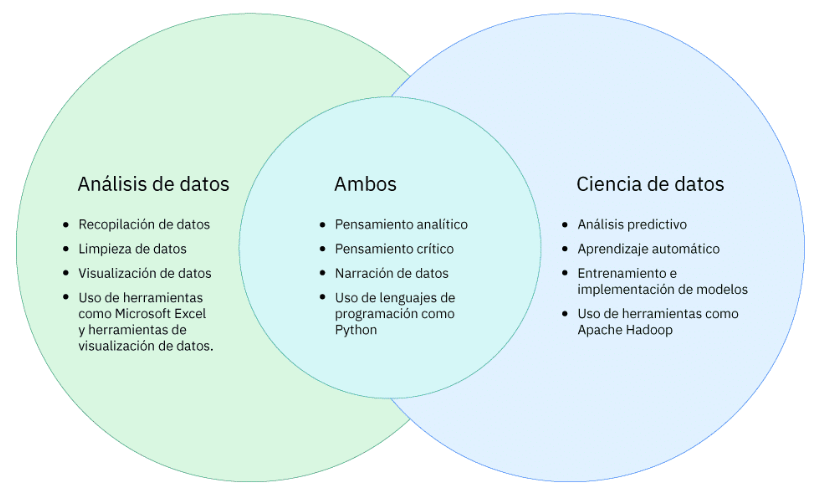
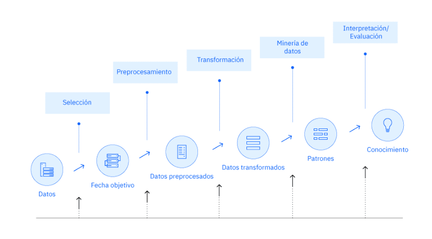
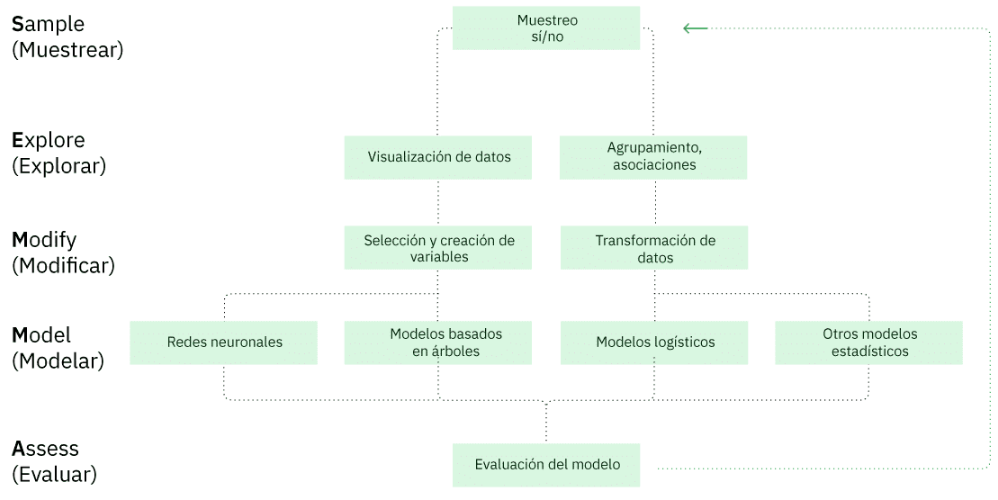

# La ciencia de datos en el mundo real

## ¿Que es la ciencia de datos?

**¿Que es la ciencia?**: Es un sistema o método que concilia la utilidad práctica con las leyes científicas

**¿Que es la ciencia de datos?**: es la comprensión del mundo a través del análisis científico de los datos digitales.

La ciencia de datos combina el método científico, las matemáticas y la estadística, la programación especializada, el análisis avanzado, la inteligencia artificial (IA) e, incluso, la narración para descubrir y explicar la información empresarial oculta en los datos.

La ciencia de datos es un enfoque multidisciplinario para extraer información procesable a partir del volumen masivo y creciente de datos que recopilan las empresas actuales.

La ciencia de datos es un proceso científico que es repetible. Eso no significa que la ciencia de datos sea mecánica y carente de creatividad. Sin embargo, el procesamiento de datos incluye pasos únicos que implican la transformación de los datos sin procesar en información.

## Análisis de datos vs Ciencia de datos

El análisis de datos y la ciencia de datos son dos términos que se suelen usar en el mismo contexto. Sin embargo, es importante saber que son definiciones diferentes.

+ **Los analistas de datos** recopilan y examinan grandes conjuntos de datos para identificar tendencias, previsiones y visualizaciones de datos para narrar una historia convincente mediante información procesable. Esta información ayuda a las empresas a tomar decisiones informadas sobre sus necesidades empresariales.
+ **Los científicos de datos** diseñan y crean nuevos procesos para el modelado de datos. Emplean algoritmos, análisis predictivo y estadístico. Los científicos de datos tienen habilidades técnicas para organizar los datos no estructurados y crear sus propias metodologías para realizar predicciones basadas en tendencias de datos.

## Metodologías de ciencia de datos

### ¿que es una metodología?

Una metodología es una estrategia general que guía las actividades dentro de un proceso. Una metodología brinda a los científicos de datos un marco sobre cómo continuar con cualesquiera de los métodos y procesos que usarán para obtener respuestas o resultados.

Los científicos tienen el método científico. Y, al igual que los científicos, los científicos de datos necesitan una metodología fundamental que los oriente para resolver problemas.

estas son las **tres metodologías clásicas de ciencia de datos** adoptadas ampliamente:

+ Cross-Industry Standard Process for Data Mining (CRISP-DM)
+ Extracción de conocimientos en bases de datos (KDD)
+ Muestrear, Explorar, Modificar, Modelar, Evaluar (SEMMA).

**CRISP-DM**, **KDD** y **SEMMA**:

+ Usan métodos de **minería de datos**

+ Son las más indicadas para los **datos estructurados**

+ Son útiles para usar **análisis descriptivo** y **predictivo**

+ Comparten algunas actividades comunes, como la **recopilación** de datos, la **transformación** de datos, el **modelado** de datos y la **evaluación** de modelos

*Estas metodologías no son útiles en proyectos que trabajan con datos no estructurados, como imágenes y texto*.

### CRISP-DM

CRISP-DM significa Cross-Industry Standard Process for Data Mining o Proceso estándar intersectorial de minería de datos. Es una forma comprobada de orientar la minería de datos. Cualquier industria puede usar este metodología para ayudar a estructurar un proyecto de ciencia de datos. CRISP-DM es un enfoque de ciencia de datos flexible e integral.

CRISP-DM consta de seis fases con flechas que indican las dependencias más importantes y frecuentes entre las fases:

1. Comprensión del negocio
2. Comprensión de los datos
3. Preparación de los datos
4. Modelado
5. Evaluación
6. Implementación

La secuencia de las fases no es estricta. CRISP-DM es iterativo, lo que significa que las fases se pueden repetir para mejorar gradualmente el resultado. Los resultados de algunas fases pueden requerir que el ciclo del proyecto vuelta a las fases anteriores.

### KDD

KDD significa Extracción de conocimientos en bases de datos, representa el proceso general de recopilación de datos y su refinamiento metódico.

KDD suele constar de cinco pasos:

+ Selección
+ Preprocesamiento previo
+ Transformación
+ Minería de datos
+ Interpretación y evaluación

El proceso no aborda la realidad moderna de los proyectos de ciencia de datos, como la implementación de una arquitectura de big data, las consideraciones éticas o los diferentes roles en un equipo de ciencia de datos.

KDD es iterativo, lo que significa se se pueden integrar y transformar nuevos datos para obtener resultados diferentes y más apropiados. Los conocimientos adquiridos se pueden reciclar en el proceso, lo que mejora su eficacia.

### SEMMA

SEMMA representa sus cinco pasos:

+ **Sample** o Muestrear
+ **Explore** o Explorar
+ **Modify** o Modificar
+ **Model** o Modelar
+ **Assess** o Evaluar

El Instituto **SAS** desarrolló **SEMMA** como un proceso de minería de datos. **SEMMA** está enfocado principalmente en las tareas de modelado de proyectos de minería de datos.

**SEMMA** también es un proceso iterativo, en la que la respuesta a un conjunto de preguntas suele llevar a preguntas mucho más interesantes y específicas.

### Seguimiento de una metodología en ciencia de datos

Estos son los pasos de la metodología de ciencia de datos que aprenderás:

1. Comprensión del negocio
2. Exploración y preparación de datos
3. Representación y transformación de datos
4. Visualización y presentación de datos
5. Modelos de datos de trenes
6. Implementar modelos de datos

### 01. Comprensión del negocio

El patrocinador empresarial desempeña un papel crítico, plantean el problema empresarial al equipo de proyectos de ciencia de datos  y luego apoya el proyecto.

El equipo de proyectos de ciencia de datos examina el problema empresarial. **El pensamiento de diseño** es una metodología de resolución de problemas que se enfoca en el usuario, sintiendo empatía por el usuario y determinando la mejor experiencia de usuario.

+ definir el problema
+ determinar los objetivos del proyecto
+ desarrollar personajes o personajes ficticios que representen a los usuarios finales típicos
+ documentar los requisitos de la solución desde una perspectiva empresarial

Una vez que se haya expuesto el problema empresarial claramente, el científico de datos del equipo definirá el enfoque analítico para resolver el problema. Esto implica expresar el problema en el marco de las técnicas estadísticas y de aprendizaje automático.

### 02. Exploración y preparación cde datos

Los científicos de datos identifican y recopilan datos de fuentes existentes y, a menudo nuevas, de una empresa. Pueden recuperar datos de fuentes como:

+ Archivos estáticos, como hojas de cálculo
+ Bases de datos
+ Internet

Una vez que los datos estén en un formato, el científico de datos necesita trabajar en ellos, puede empezar la exploración de datos. Estas son algunas preguntas que el científico de datos puede pensar durante la exploración inicial de los datos:

1. ¿Qué características de los datos parecen prometedoras para un análisis más profundo?

2. ¿La exploración ha revelado nuevas características sobre los datos?

3. ¿La exploración ha cambiado la hipótesis inicial?

A continuación, el científico de datos prepara los datos. La preparación de datos es muy importante y el paso que consume más tiempo en un proyecto de ciencia de datos. Implica la construcción del conjunto de datos que se utilizará en el paso de modelado. Además, la preparación de datos incluye limpiar los datos, combinarlos de varias fuentes y asegurarse de que no haya brechas en los datos.

Los científicos de datos no pueden asumir que los datos estén listos para utilizarse, incluso si son datos estructurados.

+ los datos pueden estar incompletos o tener valores incorrectos
+ estar dañados con líneas rotas o tener campos en lugares equivocados
+ ser demasiado aleatorios
+ ser irrelevantes
+ ser un valor atípico, es un valor que se encuentra alejado de otros valores y que sesgará los datos
+ ser un valor omitido en algunos campos

### 03. Representación y transformación de datos

El paso de representación y transformación de datos de la metodología de ciencia de datos trata de:

+ comprender los datos
+ evaluar la calidad de los datos
+ descubrir la información inicial sobre los datos

Para comprender los datos, el científico de datos puede utilizar un enfoque matemático, como la estadística descriptiva. La estadística descriptiva resume cuantitativamente un conjunto de datos. Puede responder a la pregunta: "¿Qué ocurre?".

+ **Número (N)**: ¿Cuál es el número total de observaciones?
+ **Significado**: ¿Cuál es el promedio de un conjunto de dos o más números?
+ **Media**: ¿Cuál es el número medio o "centro" en una lista ordenada de números?
+ **Moda**: ¿Cuál es el valor más observado en un conjunto de datos?
+ **Mínimo**: ¿Cuál es el extremo mínimo de un conjunto de datos?
+ **Máximo**: ¿Cuál es el extremo máximo de un conjunto de datos?
+ **Desviación estándar**: ¿Cómo se distribuyen los datos en relación con la media?

La siguiente tabla indica los ingresos promedios familiares en dólares americanos de los clientes de una empresa, en función de su nivel educativo. Los datos son ficticios y a efectos ilustrativos.

||No completó la escuela secundaria|Título de bachillerato|Un poco de universidad|Título universitario|
|--|--|--|--|--|
|Promedio|51,48|52|56,90|70,94|
|Desviación estándar|51 855|56 370|53 836|67 940|
|N|246|527|333|310|
|Media|36,00|35,00|39,00|49,00|
|Mínimo|15|12|13|15|
|Máximo|497|533|403|512|

La estadística descriptiva, las técnicas de visualización y muchas otras técnicas ayudan a los científicos de datos a comprender los datos y evaluar su calidad. Los equipos de ciencia de datos deben validar la calidad de los datos que utilizan como entrada para el modelado predictivo, ya que unos datos de mala calidad conducirán a un rendimiento deficiente del modelo más adelante en el proceso.

La representación de datos va seguida de la transformación de datos. Independientemente del formato de los datos de origen, el científico de datos estructura y organiza los datos en un formato compatible con el modelo de aprendizaje automático más eficiente posible. El aprendizaje automático es una rama de la inteligencia artificial (IA) y las ciencias computacionales que se centra en el uso de datos y algoritmos para imitar la forma en la que los humanos aprenden, mejorando progresivamente su precisión. Los modelos de aprendizaje automático solo comprenden números, no textos ni imágenes, por lo que los científicos de datos pueden necesitar transformar los datos no estructurados en un "0" o un "1".

El científico de datos puede desglosar el texto en palabras, frases, símbolos u otros elementos significativos denominados tokens. Esta técnica denominada tokenización, que es una de las muchas técnicas de transformación de datos.

### 04. Visualización y presentación de datos

La visualización de datos es la culminación de los esfuerzos del equipo de ciencia de datos para ver la información que han producido sus actividades de transformación de datos.

Los datos deben narrar una historia y abordar el problema empresarial o pregunta que el proyecto intenta responder. El objetivo es tener una visualización que sea eficaz, atractiva e impactante.

#### **Consideraciones para la presentación de datos**

La presentación de datos final debe ser significativa, convincente y, sobre todo, fácil de interpretar. El diseño de la presentación de un equipo debe ir más allá de simplemente mostrar los resultados y el aspecto de la visualización. El equipo debe considerar:

+ **Finalidad**: ¿Qué problema intentas abordar y por qué la visualización de datos ayudará a resolverlo?
+ **Público**: ¿Quién verá la presentación y cómo puede ser valiosa para ellos?
+ **Datos**: ¿Están los datos representados de la mejor manera y se deberá actualizar la visualización en el futuro?
+ **Contexto**: ¿Dónde residirá la visualización (por ejemplo, en un software, un sitio web o un informe empresarial)?

### 05. Entrenamiento de modelos de datos

¿Qué se entiende por un modelo?

+ **¿Qué es un modelo?** Un modelo de datos identifica los datos, los atributos de datos y las relaciones o asociaciones con otros datos. Un modelo de datos proporciona una vista generalizada de los datos que representa el escenario empresarial y los datos reales.
+ **¿Por qué crear un modelo?** El científico de datos puede desarrollar un enfoque mas sistemático para abordar el problema empresarial identificado mediante la creación de un modelo. El objetivo principal de crear un modelo es realizar mejores predicciones para la empresa y obtener una mejor comprensión del sistema que se está modelando.

Los científicos de datos deben entrenar un modelo, usando Aprendizaje automático.

Estos son tres métodos de aprendizaje automático, en función de los algoritmos utilizados y los resultados que se requieren.

+ **Aprendizaje supervisado**: En el aprendizaje supervisado, la máquina ingiere muchas preguntas y sus respuestas, básicamente un conjunto de información estructurada previamente. La información puede, por ejemplo, ser dibujos e imágenes de animales, algunos de los cuales son perros y estar etiquetada como "perro". La máquina intenta  identificar patrones de modo que cuando vea una nueva foto de un perro y se le pregunte "¿Qué es?", pueda responder "perro" con gran precisión. El aprendizaje supervisado entrena a las máquinas con datos para crear reglas generales que pueden aplicarse a problemas futuros. Cuanto mejor sea el conjunto de datos de entrenamiento, mejor será el resultado.
+ **Aprendizaje no supervisado**: En el aprendizaje no supervisado, la máquina ingiere una enorme cantidad de información, se le formula una pregunta y se le permite determinar cómo responderla por sí sola. Por ejemplo, la máquina puede recibir muchas fotos y artículos sobre perros. La máquina ingiere y clasifica la información dentro de todas las fotos y artículos. Cuando a la máquina se le muestra una nueva foto de un perro, la máquina debe ser capaz de identificarla como un perro con una precisión razonable. El aprendizaje no supervisado entrena máquinas con un gran volumen de datos no etiquetados o no estructurados.
+ **Aprendizaje reforzado**: Los humanos y las máquinas pueden aprender mediante el aprendizaje reforzado. El aprendizaje reforzado es una técnica de aprendizaje automático basada en la retroalimentación. A través del aprendizaje reforzado, la máquina determina cómo comportarse en un entorno realizando y observando los resultados de sus acciones. Por cada acción "buena", la máquina recibe una retroalimentación positiva (una recompensa). Por cada acción "mala", la máquina recibe una retroalimentación negativa (una penalización). Como resultado, la máquina aprende automáticamente mediante su experiencia y retroalimentación. El aprendizaje reforzado no implica un objetivo específico. Más bien, implica aprender por ensayo y error o "aprender sobre la marcha". El aprendizaje reforzado se utiliza ampliamente en los vehículos autónomos, drones y otras aplicaciones robóticas.

La siguiente es una tabla que compara el aprendizaje supervisado con el aprendizaje no supervisado.

||Aprendizaje supervisado|Aprendizaje no supervisado|
|--|--|--|
|Proceso|Se proporcionan las variables de entrada y salida|Solo se proporcionan datos de entrada|
|Datos de entrada|Los algoritmos se entrenan utilizando datos etiquetados|Los algoritmos se utilizan con datos que no están etiquetados|
|Complejidad|Método más sencillo|Computacionalmente complejo|
|Uso de datos|Utiliza datos de entrenamiento para identificar un vínculo entre la entrada y las salidas|No utiliza datos de salida|
|Precisión de los resultados|Método altamente preciso y confiable|Método menos preciso y confiable|
|Ejemplos de uso|Detección de fraudes, clasificación de imágenes, previsión meteorológica, previsión de mercado y estimación de la esperanza de vida|Segmentación de clientes, marketing dirigido, comprensión significativa y sistemas que recomiendan música o películas en streaming|

### 06. Implementación del modelo de datos

La implementación de un modelo es el paso en el que el modelo de aprendizaje automático se integra en el entorno de producción de la empresa. Los científicos de datos realizan este paso utilizando el conjunto de herramientas y el software elegidos por la empresa. Una vez que se guarda e implemente el modelo, éste se puede utilizar para seguir creando mejores predicciones para soluciones futuras. El modelo opera según un plan y el científico de datos lo debe mantener.

## Aplicación de la ciencia de datos en mundo real

La ciencia de datos puede:

+ identificar y predecir enfermedades y personalizar recomendaciones en el **sector de los cuidados de la salud**
+ optimizar las rutas de envío en tiempo real para el **transporte**
+ evaluar con precisión el rendimiento de los atletas en los **deportes**
+ prevenir la evasión fiscal y predecir las tasas de encarcelamiento para los **gobiernos**
+ automatizar la colocación de anuncios digitales en el **comercio electrónico**
+ mejorar las experiencias en línea para los **videojuegos**
+ crear algoritmos para identificar socios compatibles para **redes sociales**

Fuente: [30 Data Science Applications and Examples](https://builtin.com/data-science/data-science-applications-examples)

## El equipo de proyectos de ciencia de datos

La ciencia de datos no es solo fuentes de datos y metodologías, también incluye personas. En la práctica, varias personas trabajan en un equipo. ¡No es solo un científico de datos! Los resultados del análisis son tan buenos como el equipo responsable de recopilar, analizar e interpretar los datos.

+ **Analista de datos**: Está en la oficina todos los días, trabaja con datos estructurados en bases de datos y utiliza la estadística. La responsabilidad principal es recopilar, organizar, limpiar y analizar grandes volúmenes de datos. Utiliza métodos y herramientas normalizados de su empresa para identificar tendencias, encontrar patrones y hacer predicciones. Conoce el sector y utiliza sus conocimientos del negocio. Comunica su hallazgos y muestra la información a los patrocinadores empresariales mediante visualizaciones y presentaciones de datos para ayudarles a tomar decisiones y adoptar acciones. LAs siguientes son características típicas del rol de analista de datos:
  + Hay que ser metódico
  + Pensador crítico
  + Tener experiencia en el uso de herramientas de transformación de datos para limpiarlos y herramientas de visualización para mostrar la información
  + Ser un gran comunicador con habilidades de presentación
+ **Científico de datos**: Está en la oficina y participa de principio a fin en los proyectos.
  + Dado el problema empresarial, desarrolla una hipótesis para investigar y encontrar patrones ocultos.
  + Trabaja con datos de muchas fuentes. Dependiendo del proyecto, puede viajar o desplazarse al campo para recopilar datos y mediciones. Los datos pueden ser estructurados o no estructurados.
  + Realiza experimentos para crear modelos personalizados mediante las herramientas y metodología de ciencia de datos de la empresa.
  + Utiliza técnicas como el aprendizaje automático para crear y entrenar modelos que predigan resultados futuros.
  + En general, transforma los datos en conocimientos para generar información procesable que pueda utilizarse para mejorar los resultados futuros.

  Características
  + Sentir siempre curiosidad y preguntarte "por qué".
  + Tener una mentalidad científica y de investigación
  + Ser solucionador de problemas
  + Tener conocimientos de matemáticas, estadística y aprendizaje automático
  + Tener experiencia en herramientas de análisis de datos

+ **Ingeniero de datos**: Gestiona la infraestructura de datos de la empresa. Su responsabilidad principal es establecer sistemas y procesos que los analistas y científicos de datos puedan utilizar y en los que puedan confiar al trabajar con datos.
  + entiende el flujo de datos y transforma grandes volúmenes de datos sin procesar en "canalizaciones" útiles para proyectos.
  + Se enfoca en las herramientas y utiliza técnicas de programación avanzadas.
  + Trabaja en los pasos para probar e implementar los modelos de aprendizaje automático en la producción para la empresa.

  Características:
  + Ser experto en tecnología
  + Tener conocimientos de matemáticas, estadística y aprendizaje automático
  + Ser experto en programación
  + Estar familiarizado con la arquitectura de la infraestructura

### **¿como colaboran juntos?**

Los analistas de datos, científicos e ingenieros de datos calificados son figuras transformadoras en la empresa moderna. Colaboran en proyectos de ciencia de datos para resolver problemas y acelerar la innovación. Esta es una descripción breve y de alto nivel para descubrir cómo interactúan y colaboran en un proyecto.

1. El analista de datos, obtiene una hoja de cálculo de una fuente de empresa gestionada por el ingeniero de datos. La hoja de cálculo contiene miles de filas y cientos de columnas. Utiliza herramientas de transformación de datos para realizar la tarea de limpiar o pulir los registros de datos. ¿Faltan valores? ¿Hay columnas redundantes? Elimina el "ruido" del conjunto de datos.
2. El analista de datos envía el conjunto de datos limpios al científico de datos, y comparte sus conocimientos empresariales y los hallazgos iniciales de los datos.
3. El científico de datos elabora una hipótesis y se pregunta: "¿Qué predicciones podemos hacer?". Utiliza técnicas estadísticas y herramientas de análisis para clasificar los datos. Luego crea y entrena un modelo con los datos.
4. El científico de datos trabaja con el ingeniero de datos, para implementar el modelo entrenado en la empresa.
5. Los tres perfiles trabajan para validar el éxito del modelo entrenado. ¿Es correcta su hipótesis? ¿Debe utilizar técnicas diferentes?continúan experimentando.
6. El científico de datos extrae los conocimientos y determina las acciones que la empresa puede tomar para mejorar los resultados futuros.
7. El analista de datos crea una visualización de datos significativa e impactante para "contar la historia". La comparte con el equipo para que pueda programar una presentación con el patrocinador empresarial.

#### Algunas notas interesantes

+ Todos los miembros del equipo son responsables de comprender el problema empresarial para que puedan trabajar en la propuesta de una solución.
+ Las organizaciones utilizan diferentes puestos para los roles que trabajan con datos. Dependiendo del tamaño de la organización, una persona puede tener un rol y responsabilidades combinados.
+ Hay otros roles que no se cubren aquí. Por ejemplo, puedes encontrar a alguien que sea un periodista de datos. El periodista de datos mantiene una mentalidad centrada en el cliente y su responsabilidad principal es la comunicación de los resultados. Si bien no es un rol técnico, el periodista de datos es un comunicador altamente calificado que convierte los hechos en una historia convincente con información y visualizaciones de datos.

## Resumen

1. La ciencia de datos combina el método científico, las matemáticas y la estadística, la programación especializada, el análisis avanzado, la inteligencia artificial (IA) e, incluso, la narración para descubrir y explicar la información empresarial oculta en los datos.

2. Los científicos de datos utilizan metodologías que incluyen procesos o actividades que se deben realizar para obtener resultados. Las metodologías también son científicas, por lo que la clave es que son repetibles.

3. Las tres metodologías de ciencia de datos ampliamente utilizadas son: Cross-Industry Standard Process for Data Mining (CRISP-DM), Extracción de conocimientos en bases de datos (KDD) y Muestrear, Explorar, Modificar, Modelar y Evaluar (SEMMA).

4. Las actividades clave que tienen lugar durante un proyecto de ciencia de datos son:

    + Comprensión del negocio
    + Exploración y preparación de datos
    + Representación y transformación de datos
    + Visualización y presentación de datos
    + Entrenamiento de modelos de datos de trenes
    + Implementación de modelos de datos
5. Quienes trabajan en la ciencia de datos utilizan tecnologías y herramientas para crear modelos. Los modelos se utilizan para predecir resultados o descubrir patrones subyacentes. La intención es obtener conocimientos que conduzcan a acciones que mejoren los resultados futuros.

6. Los científicos de datos utilizan el aprendizaje automático para entrenar modelos. El aprendizaje automático consiste esencialmente en enseñar a una computadora a resolver problemas. Permite a una máquina aprender a partir de los datos sin programarla con reglas. La máquina puede aprender de los datos que se le proporcionan.

7. Las visualizaciones de datos deben ser efectivas, atractivas e impactantes.

8. ¡Una de las características más importantes de un científico de datos es ser siempre curioso!

9. Se están llevando a cabo proyectos de ciencia de datos en el mundo real, en las plataformas de redes sociales y sectores como el de los cuidados de la salud, el transporte, los deportes, el comercio electrónico, etc.

10. ¡La ciencia de datos es una labor en equipo! Los analistas de datos, los científicos de datos y los ingenieros de datos colaboran para resolver problemas empresariales.

