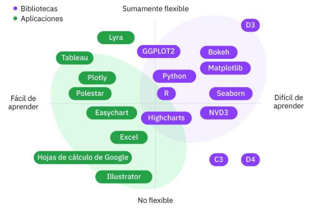

# Descripción general de herramientas y lenguajes de datos

Las personas que trabajan en el campo de la ciencia de datos resuelven problemas y responden preguntas todos los días. Crean modelos para predecir resultados y descubrir patrones subyacentes. Los resultados y hallazgos permiten a los profesionales de la ciencia de datos, como los científicos de datos, obtener información que puede llevar a acciones que mejoran los resultados futuros. Las herramientas y tecnologías de transformación de datos que utilizan los científicos de datos son fundamentales para lograr esos resultados.

## El valor del código abierto

El software de código abierto es un software con código que se publica públicamente y que todo el mundo puede utilizar.

El software de código abierto es colaborativo, lo que significa que se apoya en una comunidad virtual de personas para revisar, modificar y compartir el código fuente entre sí.

Los siguientes son 4 aspectos clave del software de código abierto:

1. **Uso**: cualquiera puede utilizar y ejecutar el software para cualquier propósito, bajo licencia.
2. **Vista**: cualquiera puede ver el código fuente para comprender el funcionamiento del software.
3. **Modificación**: las mejoras, las correcciones de errores y soluciones pueden proceder de cualquier persona.
4. **Intercambio**: las contribuciones se basan en un propósito común y compartido.

lo que sigue es definir algunos conceptos que son recurrentes en el lenguaje cotidiano del código abierto.

+ Una **comunidad** es cualquiera relacionado con un proyecto de código abierto. Es un grupo de personas que obtienen algún beneficio del proyecto.
+ Un **colaborador** es alguien que contribuye a un proyecto.
+ Un **committer** es alguien que revisa y aprueba los cambios realizados en el código fuente del proyecto. El committer tiene acceso de escritura (o permiso de escritura) a un repositorio de código fuente. Esto significa que están autorizados a actualizar los datos.
+ El **código de conducta** protege a la comunidad y proporciona pautas sobre el comportamiento aceptable. Todos los proyectos deben tener un código de conducta.
+ Las **pautas de contribución** describen cómo contribuir y colaborar. Proporcionan reglas sobre cómo la comunidad puede participar en el proyecto de código abierto.

Desde la perspectiva del científico de datos o ingeniero de datos que trabaja con código en un proyecto, es fundamental el acceso abierto a nuevas tecnologías clave. Las comunidades de código abierto pueden:

+ ser un recurso para la mentoría
+ brindar oportunidades para que los desarrolladores interactúen y muestren su experiencia en la materia
+ ayudar potencialmente a las personas que empiezan su recorrido de codificación a progresar en su profesión

Desde la perspectiva de una empresa, el software de código abierto brinda muchos beneficios.

+ Las empresas pueden utilizar el modelo comunitario para aumentar la innovación. Por ejemplo, es posible que el código de un proyecto ya esté escrito y esté disponible en una comunidad de código abierto.
+ Existe un potencial de ahorro de costos al desarrollar software y documentar, probar y corregir errores.
+ Comenzar un proyecto o contribuir a un proyecto existente puede ayudar a las empresas a influir en la dirección del desarrollo tecnológico.
+ El software de código abierto puede ayudar a las empresas a aumentar la seguridad y confiabilidad del software y seguir el ritmo de la competencia.

## Git y GitHub

+ **Git** es un sistema de control de versiones para realizar el seguimiento de los cambios en el código fuente durante el desarrollo del software. Ayuda a coordinar el trabajo entre los programadores. Git es un software de código abierto con licencia. Se instala localmente en la computadora.
+ **Github** es un servicio en línea que proporciona un lugar para alojar tanto código fuente como para contribuir y colaborar. Permite que las personas trabajen juntas en proyectos desde cualquier lugar. GitHub es un servicio, no un software. Ofrece cuentas gratuitas, profesionales y empresariales.

La gente trabaja con **repositorios** en GitHub. Un repositorio es como una carpeta para tu proyecto. Puedes tener varios repositorios públicos y privados en GitHub. Los repositorios pueden contener archivos, imágenes, videos, hojas de cálculo y conjuntos de datos. GitHub proporciona el historial de revisiones de todos los archivos de un repositorio.

En general, en GitHub puedes:

+ Alojar tu propio proyecto de código abierto. Para ello, crea un repositorio en línea y agrega archivos.
+ Contribuir a un proyecto existente de código abierto que es público. Para ello, accede a una copia del repositorio del proyecto, realiza actualizaciones y solicita una revisión de los cambios que deseas aportar.

## Herramientas para analizar y visualizar datos

### Microsoft Excel

Microsoft Excel (MS Excel) es una aplicación de hoja de cálculo creada por Microsoft. MS Excel es una de las herramientas más utilizadas para el análisis de datos.

Puedes utilizar MS Excel para introducir, examinar e interpretar datos de diversas maneras.  

+ Puedes manipular y limpiar los datos en filas y columnas antes del análisis.
+ MS Excel tiene funciones y características de análisis de datos integradas, como filtración, fórmulas y tablas dinámicas.

También puedes utilizar MS Excel para ayudar a visualizar conjuntos de datos y obtener información de los datos.

+ MS Excel ofrece diferentes tipos de gráficos, como circulares, de barras, de líneas y de dispersión.
+ Puedes utilizar plantillas integradas y recomendaciones de MS Excel para crear un gráfico basado en tus datos.
+ Puedes combinar diferentes tipos de gráficos en una hoja de cálculo en MS Excel.

### SQL

El lenguaje de consulta estructurado (SQL) es un lenguaje estándar para comunicarte con bases de datos. Como el nombre sugiere, utilizas SQL cuando tienes datos estructurados en una base de datos relacional. SQL ha sido una referencia del Instituto Nacional Estadounidense de Estándares (ANSI) desde 1986 y de la Organización Internacional de Normalización (ISO) desde 1987.

SQL es un lenguaje de consulta, no un lenguaje de programación.

+ El propósito es formular preguntas o "consultar" una base de datos relacional o modificar su contenido.
+ Puedes utilizar las consultas SQL para realizar operaciones en una base de datos, como seleccionar, recuperar, actualizar y eliminar datos.
+ Los comandos SQL, como "Select", "Insert", "Update", "Delete", "Create" y "Drop" pueden realizar la mayoría de cosas que necesitas hacer con una base de datos.

Con SQL se puede:

+ Ejecutar consultas en una base de datos
+ Recuperar datos de una base de datos
+ Insertar registros en una base de datos
+ Actualizar registros en una base de datos
+ Eliminar registros de una base de datos
+ Crear nuevas bases de datos
+ Crear nuevas tablas en una base de datos
+ Crear procedimientos almacenados en una base de datos
+ Crear vistas en una base de datos
+ Establecer permisos en tablas, procedimientos y vistas

**¿QUe es NoSQL?**

**NoSQL** es una abreviatura de "no solo SQL". Si bien SQL te permite trabajar con datos estructurados en bases de datos relacionales, NoSQL te permite trabajar con datos no estructurados en bases de datos no relacionales. NoSQL es útil para Big Data y las aplicaciones web en tiempo real. Por ejemplo, una empresa como Twitter que recopila terabytes de datos de usuarios cada día puede utilizar NoSQL.

Los científicos de datos también utilizan NoSQL para comunicarse con las bases de datos NoSQL.

+ El propósito es almacenar y trabajar con datos no estructurados, como muchas imágenes y texto.
+ Los tipos de bases de datos NoSQL incluyen bases de datos de documentos, bases de datos de columnas anchas y bases de datos de gráficos.
+ En general, los profesionales de la ciencia de datos utilizan SQL para explorar, mantener y proteger datos para poder tomar mejores decisiones.

### Python

Python es un lenguaje de programación gratuito, de código abierto y uso general que está disponible para que todos lo utilicen. Python fue creado por Guido van Rossum y lanzado en 1991.

puedes utilizar Python para conectarte a sistemas de bases de datos y leer y modificar archivos.

Python puede manejar Big Data y realizar operaciones matemáticas complejas.

puedes combinar Python con una biblioteca de software de análisis y manipulación de datos, como pandas. Python puede ayudarte a obtener información y crear visualizaciones de datos.

### IBM Watson Studio

IBM tiene una solución llamada IBM Watson Studio. IBM Watson Studio es un entorno de desarrollo integrado (IDE), reúne las herramientas de desarrollo y análisis más útiles, envolviéndolas en una plataforma de desarrollo que es lo suficientemente potente como para enfrentar desafíos a gran escala.

+ Es un entorno colaborativo de ciencia de datos y aprendizaje automático.
+ IBM Watson Studio trabaja con herramientas de código abierto.
+ IBM Watson Studio ofrece una interfaz gráfica con operaciones integradas.
+ No es necesario saber codificar para utilizar la herramienta.

Además, IBM Watson Studio tiene una herramienta integrada de refinación de datos(se abre en una nueva pestaña).

+ La refinación de datos te permite preparar y transformar grandes cantidades de datos sin procesar en datos de alta calidad.
+ Puedes visualizar los datos utilizando cuadros y gráficos integrados para comprender la distribución de tus datos.
+ Puedes programar trabajos para que los datos produzcan resultados repetibles.Es un entorno colaborativo de ciencia de datos y aprendizaje automático.

IBM Watson Studio trabaja con herramientas de código abierto.

IBM Watson Studio ofrece una interfaz gráfica con operaciones integradas.

No es necesario saber codificar para utilizar la herramienta.

Además, IBM Watson Studio tiene una herramienta integrada de refinación de datos(se abre en una nueva pestaña).

La refinación de datos te permite preparar y transformar grandes cantidades de datos sin procesar en datos de alta calidad.

Puedes visualizar los datos utilizando cuadros y gráficos integrados para comprender la distribución de tus datos.

Puedes programar trabajos para que los datos produzcan resultados repetibles.

### Tableau

es un software de visualización de datos e inteligencia empresarial popular para obtener información relevante de los datos. Muchas empresas utilizan Tableau para generar representaciones gráficas e ilustradas de los datos.

Con Tableau, puedes:

+ analizar grandes volúmenes de datos.
+ crear diferentes paneles, gráficos, tablas, mapas, historias, etc., para ayudar a tomar decisiones empresariales.
+ realizar tareas sin experiencia en programación. Ofrece una interfaz intuitiva.
+ diseñar visualizaciones interactivas.

### Matplotlib

Matplotlib es una biblioteca multiplataforma que proporciona varias herramientas para crear gráficos bidimensionales a partir de datos, en listas o matrices, en Python. John Hunter introdujo Matplotlib en 2002. Matplotlib es un proyecto comunitario de código abierto mantenido por y para sus usuarios.

+ El script Matplotlib Python está estructurado de modo que, en la mayoría de instancias, unas pocas líneas de código pueden generar un gráfico de datos visual.
+ Puedes crear diferentes tipos de gráficos, como gráficos de dispersión, histogramas, gráficos de barras, etc.
+ Las visualizaciones pueden ser estáticas, animadas e interactivas.
Se pueden exportar a muchos tipos de formatos de archivo diferentes.

## La herramienta perfecta

Todas las herramienta de transformación de datos están diseñadas con un uso específico en mente. A veces, las herramientas se solapan y tienen el mismo propósito. Pero cada herramienta tiene sus ventajas y desventajas. Las experiencias pueden variar y cada persona tendrá sus propias preferencias.

Hay muchos factores que una empresa puede tener en cuenta a la hora de elegir las herramientas de análisis y visualización de datos. Estas son varias preguntas que una empresa puede tener en cuenta:

+ ¿Qué tipos de datos se analizarán?
+ ¿Es necesario realizar procesos específicos, como el modelado de datos?
+ ¿Cuál es el volumen de datos? ¿Es Big Data?
+ ¿Qué tipos de visualizaciones se necesitan? Por ejemplo, ¿necesitan ser interactivas?
+ ¿Qué nivel de tecnicismo se necesita y qué funciones laborales utilizarán las herramientas? Por ejemplo, ¿utilizarán la herramienta científicos de datos o profesionales del marketing?
+ ¿Cual es el presupuesto?

## Resumen

1. El software de código abierto es un software con código que se publica públicamente para que cualquiera pueda utilizarlo y colaborar entre una comunidad virtual de personas. El código abierto permite a quienes trabajan en proyectos de ciencia de datos aprender nuevo software y desarrollar nuevas habilidades. Proporciona muchos beneficios potenciales a las empresas, como innovación acelerada, ahorro de costos y competitividad.

2. GitHub es un servicio gratuito en línea que se utiliza para alojar, colaborar y contribuir en el código fuente mediante repositorios.

3. Microsoft Excel es un software que se utiliza para introducir, manipular, analizar y visualizar datos. Hojas de cálculo de Google es una alternativa a Microsoft Excel.

4. Lenguaje de consulta estructurado (SQL) es un lenguaje estándar para "consultar" o comunicarse con bases de datos para modificarlas.

5. IBM Watson Studio tiene una herramienta de refinación de datos con cuadros y gráficos integrados para comprender la distribución de los datos.

6. Tableau es un software para analizar grandes volúmenes de datos y crear diferentes tipos de visualizaciones, incluyendo paneles interactivos.

7. Matplotlib es una biblioteca en Python que se utiliza para crear diferentes gráficos y diagramas.

8. Hay muchas herramientas de ciencia de datos y lenguajes de programación que se pueden utilizar durante un proyecto de ciencia de datos. ¡Es importante seleccionar la herramienta correcta para cada trabajo, en el momento adecuado!

9. Muchas herramientas no requieren experiencia previa en codificación. Algunas herramientas te permiten probarlas y utilizarlas de forma gratuita o consultar tutoriales en línea.
